# AI Research Copilot

[](https://opensource.org/licenses/MIT)
[](https://www.python.org/)
[](https://nextjs.org/)
[](https://fastapi.tiangolo.com/)
[](https://www.docker.com/)
[](https://www.postgresql.org/)
[](https://redis.io/)
[](https://qdrant.tech/)

**Enterprise-grade Agentic AI Research Copilot with RAG, Multi-Agent Orchestration, and MCP Integration**

---

## 📋 Table of Contents

- [Project Title](#project-title)
- [Project Overview](#-project-overview)
- [Architecture Overview](#-architecture-overview)
- [Technology Stack](#-technology-stack)
- [Project Folder Structure](#-project-folder-structure)
- [Backend Architecture](#-backend-architecture)
- [Frontend Architecture](#-frontend-architecture)
- [AI Architecture](#-ai-architecture)
- [RAG Pipeline](#-rag-pipeline)
- [MCP Integration](#-mcp-integration)
- [Database](#-database)
- [Environment Variables](#-environment-variables)
- [Installation](#-installation)
- [Running the Project](#-running-the-project)
- [API Documentation](#-api-documentation)
- [Authentication](#-authentication)
- [Development Workflow](#-development-workflow)
- [Testing](#-testing)
- [Deployment](#-deployment)
- [Monitoring](#-monitoring)
- [Troubleshooting](#-troubleshooting)
- [Developer Guide](#-developer-guide)
- [Contributing](#-contributing)
- [License](#-license)

---

## 🎯 Project Overview

### What This Project Is

AI Research Copilot is an enterprise-grade, open-source platform that combines **multi-agent AI systems**, **Retrieval-Augmented Generation (RAG)**, and **Model Context Protocol (MCP)** to create an intelligent research assistant. The platform orchestrates multiple specialized AI agents to perform complex research tasks, analyze documents, and generate insights.

### Why It Exists

Traditional AI assistants often struggle with:
- **Context limitations** - Large documents require chunking and intelligent retrieval
- **Task complexity** - Multi-step research requires orchestration
- **Tool integration** - Connecting to external tools and services
- **Knowledge persistence** - Maintaining context across sessions

This platform solves these challenges by providing a modular, extensible architecture for building intelligent AI-powered applications.

### Business Goals

| Goal | Description |
|------|-------------|
| **Intelligent Research** | Automate complex research tasks with multi-agent collaboration |
| **Document Intelligence** | Process and query large document collections with RAG |
| **Tool Integration** | Connect to external tools via MCP protocol |
| **Scalable Architecture** | Support enterprise-scale deployments |
| **Developer Friendly** | Provide extensible APIs and clear documentation |

### Main Capabilities

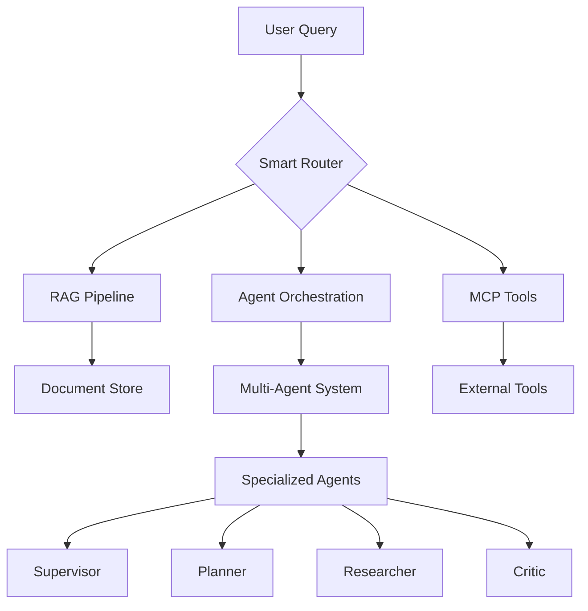

---

## 🏗️ Architecture Overview

### System Architecture

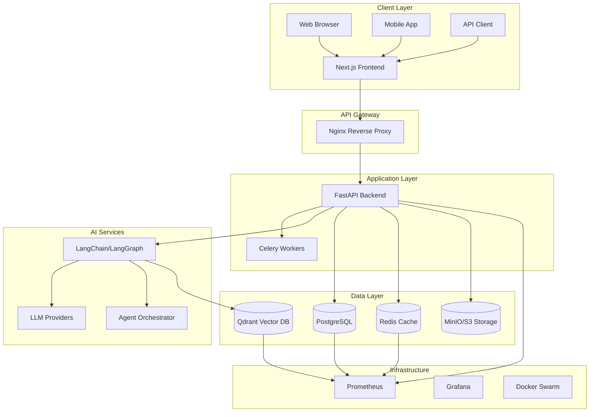

### Frontend ↔ Backend Communication

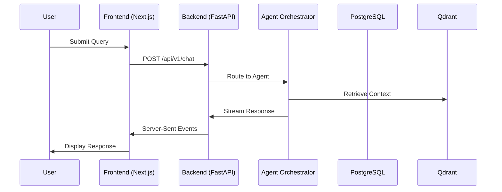

### Database Architecture

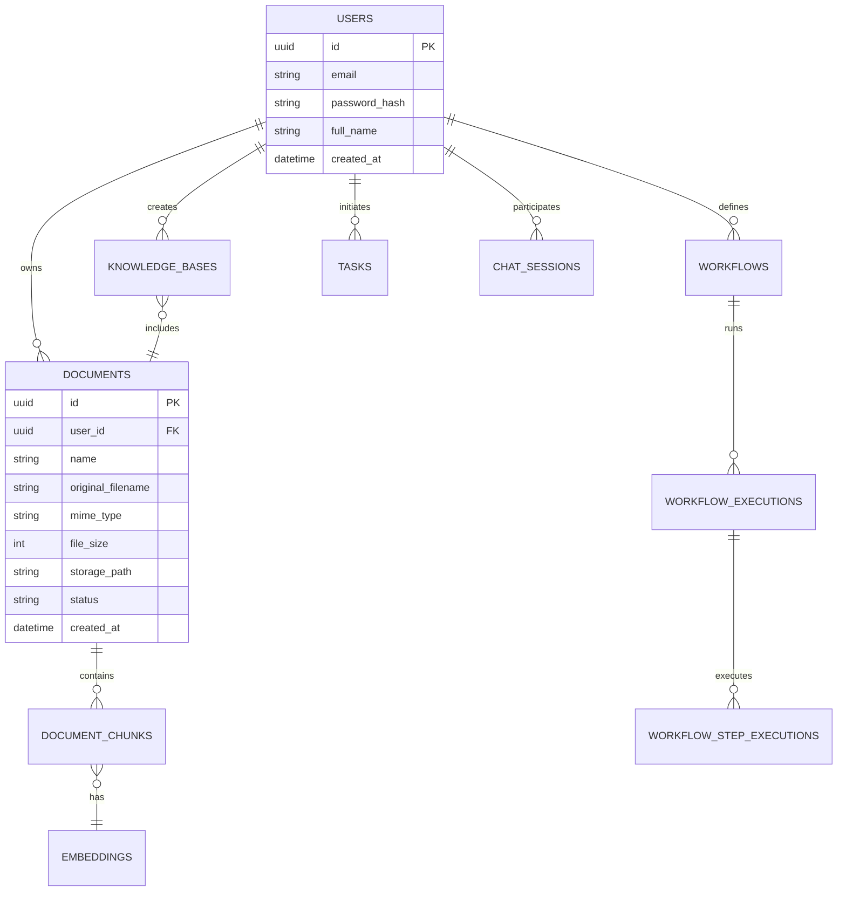

### AI Flow

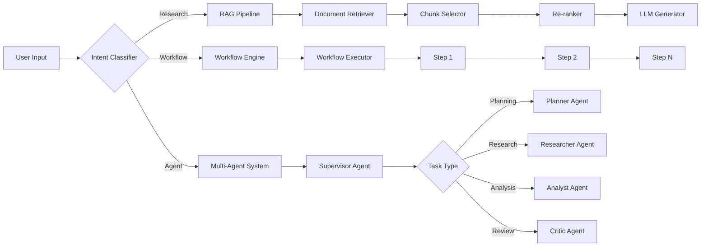

### RAG Flow

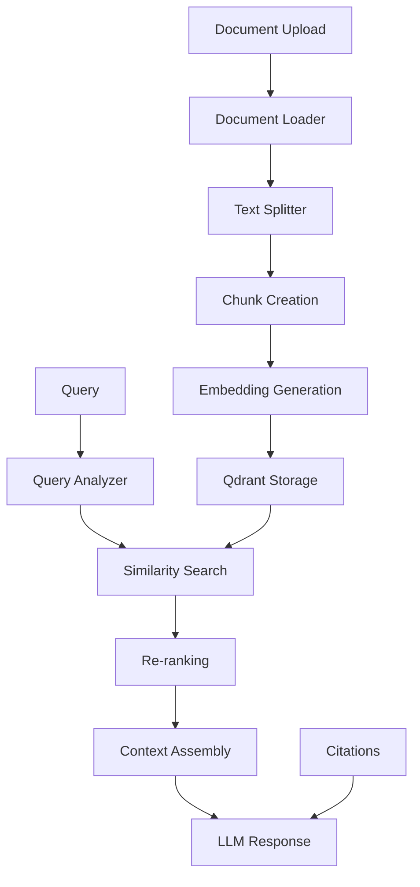

### Agent Flow

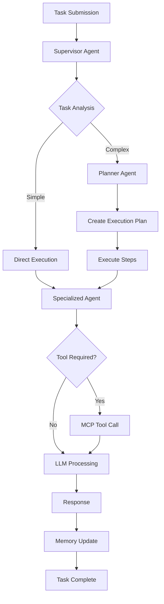

### MCP Flow

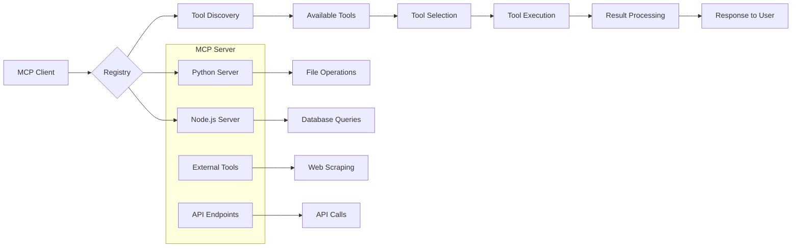

### Workflow Engine

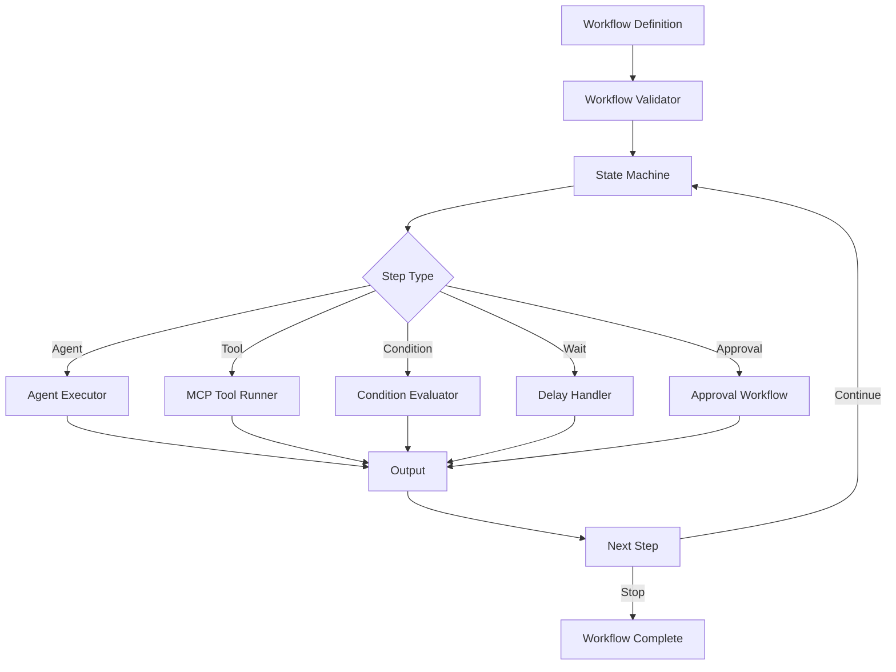

### Deployment Architecture

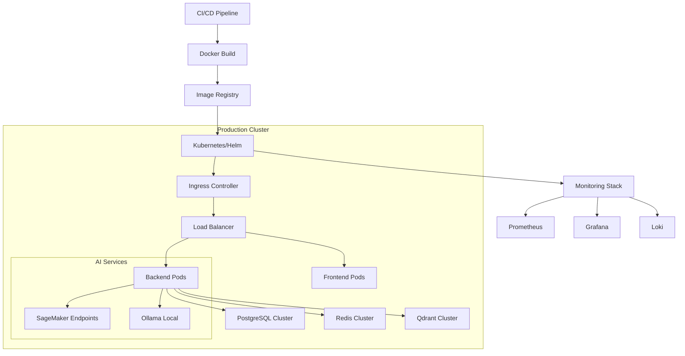

---

## 🛠️ Technology Stack

### Backend

| Technology | Version | Purpose |
|------------|---------|---------|
| **FastAPI** | 0.115.0 | Async REST API framework |
| **Python** | 3.13 | Backend language |
| **SQLAlchemy** | 2.0.36 | ORM with async support |
| **PostgreSQL** | 17 | Primary relational database |
| **Redis** | 7 | Caching and session store |
| **Celery** | 5.4.0 | Distributed task queue |
| **Alembic** | 1.14.0 | Database migrations |
| **Uvicorn** | 0.32.0 | ASGI server |

### Frontend

| Technology | Version | Purpose |
|------------|---------|---------|
| **Next.js** | 14.2.13 | React framework with App Router |
| **React** | 18.3.1 | UI library |
| **TypeScript** | 5.6.2 | Type safety |
| **TailwindCSS** | 3.4.13 | Utility-first CSS framework |
| **TanStack Query** | 5.56.0 | Server state management |
| **Zustand** | 4.5.5 | Client state management |
| **Radix UI** | Latest | Accessible UI primitives |
| **Framer Motion** | 11.5.0 | Animation library |

### Database

| Technology | Version | Purpose |
|------------|---------|---------|
| **PostgreSQL** | 17-alpine | Primary data store |
| **Redis** | 7-alpine | Session cache, message broker |
| **Qdrant** | 1.12.0 | Vector similarity search |
| **MinIO** | Latest | S3-compatible object storage |

### AI Stack

| Technology | Version | Purpose |
|------------|---------|---------|
| **LangChain** | 0.3.15 | LLM application framework |
| **LangGraph** | 0.2.53 | Agent orchestration |
| **LlamaIndex** | 0.12.10 | RAG framework |
| **OpenAI** | 1.59.0 | GPT models API |
| **Anthropic** | 0.42.0 | Claude models API |
| **Sentence Transformers** | 3.3.0 | Embedding models |
| **PyTorch** | 2.5.0 | Deep learning framework |

### Infrastructure

| Technology | Purpose |
|------------|---------|
| **Docker** | Containerization |
| **Docker Compose** | Local orchestration |
| **Nginx** | Reverse proxy |
| **Prometheus** | Metrics collection |
| **GitHub Actions** | CI/CD |

### Monitoring

| Technology | Purpose |
|------------|---------|
| **Prometheus** | Metrics collection |
| **Grafana** | Dashboard visualization |
| **OpenTelemetry** | Distributed tracing |
| **Structlog** | Structured logging |
| **Health Checks** | Service monitoring |

### Testing

| Technology | Purpose |
|------------|---------|
| **Pytest** | Python testing framework |
| **Pytest-Asyncio** | Async test support |
| **Jest** | JavaScript testing |
| **React Testing Library** | React component testing |
| **Coverage** | Code coverage analysis |

### Security

| Technology | Purpose |
|------------|---------|
| **JWT** | Authentication tokens |
| **OAuth 2.0** | Third-party auth |
| **Passlib** | Password hashing |
| **Rate Limiting** | API protection |
| **CORS** | Cross-origin protection |

### DevOps

| Technology | Purpose |
|------------|---------|
| **Poetry** | Python dependency management |
| **Pre-commit** | Git hooks |
| **Black** | Code formatting |
| **Ruff** | Linting |
| **Mypy** | Type checking |
| **GitHub Actions** | CI/CD pipeline |

---

## 📁 Project Folder Structure

### Root Structure

```
ai-research-copilot/
├── README.md
├── LICENSE
├── docker-compose.yml
├── .env.example
├── .gitignore
├── CLAUDE.md
├── pyproject.toml (backend)
└── ai-research-copilot/
    ├── backend/
    ├── frontend/
    └── docker/
```

### Backend Structure

```
backend/
├── app/
│   ├── __init__.py
│   ├── main.py              # FastAPI app entry point
│   ├── routes/            # API route definitions
│   ├── core/              # Core utilities and configurations
│   │   ├── config/
│   │   │   ├── settings.py    # Pydantic settings
│   │   │   └── logger.py      # Structured logging
│   │   ├── exceptions/
│   │   │   ├── exceptions.py  # Custom exceptions
│   │   │   └── handlers.py    # Exception handlers
│   │   ├── security/
│   │   │   ├── permissions.py # RBAC permissions
│   │   │   └── auth.py        # Authentication utilities
│   │   └── middleware/
│   │       ├── logging.py     # Request logging
│   │       └── rate_limiting.py
│   ├── database/
│   │   ├── base.py            # Base model
│   │   └── session.py         # Database session
│   ├── models/              # SQLAlchemy models
│   │   ├── document.py
│   │   ├── workflow.py
│   │   ├── analytics.py
│   │   └── __init__.py
│   ├── schemas/             # Pydantic schemas
│   │   ├── auth.py
│   │   ├── chat.py
│   │   ├── document.py
│   │   ├── agent.py
│   │   ├── memory.py
│   │   ├── task.py
│   │   ├── workflow.py
│   │   └── __init__.py
│   ├── repositories/        # Data access layer
│   │   ├── base.py
│   │   ├── user.py
│   │   ├── document.py
│   │   ├── workflow.py
│   │   └── __init__.py
│   ├── services/            # Business logic layer
│   │   ├── auth_service.py
│   │   ├── agent_service.py
│   │   ├── chat_service.py
│   │   ├── workflow_service.py
│   │   └── __init__.py
│   ├── dependencies/        # FastAPI dependencies
│   │   ├── auth.py
│   │   └── __init__.py
│   ├── agents/              # AI agent implementations
│   │   ├── supervisor.py
│   │   ├── planner.py
│   │   ├── researcher.py
│   │   ├── critic.py
│   │   └── __init__.py
│   ├── rag/                 # RAG pipeline
│   │   ├── loader.py
│   │   ├── chunker.py
│   │   ├── embedder.py
│   │   └── retriever.py
│   ├── mcp/                 # MCP integration
│   │   ├── client.py
│   │   ├── server.py
│   │   └── tools/
│   ├── workflows/           # Workflow engine
│   │   ├── executor.py
│   │   └── definitions.py
│   ├── tasks/               # Background tasks
│   │   ├── celery_app.py
│   │   └── tasks.py
│   ├── monitoring/          # Metrics and health
│   │   ├── metrics.py
│   │   └── health.py
│   └── storage/             # Storage backends
│       ├── s3/
│       └── local/
│           └── storage.py
├── tests/
│   ├── unit/
│   ├── integration/
│   └── e2e/
└── pyproject.toml
```

### Frontend Structure

```
frontend/
├── src/
│   ├── app/               # Next.js App Router
│   │   ├── layout.tsx     # Root layout
│   │   ├── page.tsx       # Home page
│   │   ├── api/           # API routes
│   │   ├── (auth)/        # Auth pages
│   │   │   ├── login/
│   │   │   ├── register/
│   │   │   └── forgot-password/
│   │   └── dashboard/     # Protected routes
│   ├── components/        # Shared components
│   │   ├── ui/            # UI primitives (shadcn/ui)
│   │   └── layout/        # Layout components
│   ├── features/          # Feature modules
│   │   ├── chat/
│   │   ├── documents/
│   │   ├── agents/
│   │   ├── workflows/
│   │   └── analytics/
│   ├── services/          # API services
│   │   └── api/
│   │       ├── client.ts
│   │       ├── auth.ts
│   │       ├── chat.ts
│   │       └── documents.ts
│   ├── hooks/             # Custom React hooks
│   ├── providers/         # Context providers
│   ├── store/             # State management (Zustand)
│   ├── types/             # TypeScript definitions
│   ├── utils/             # Utility functions
│   └── styles/            # Global styles
├── public/
├── package.json
├── tailwind.config.ts
├── tsconfig.json
└── next.config.ts
```

### Docker Structure

```
docker/
├── backend/
│   └── Dockerfile
├── frontend/
│   └── Dockerfile
├── nginx/
│   ├── nginx.conf
│   └── conf.d/
│       └── default.conf
├── postgres/
│   └── init.sql
└── monitoring/
    ├── prometheus/
    │   └── prometheus.yml
    └── grafana/
        └── provisioning/
```

---

## 🔧 Backend Architecture

### Application Flow

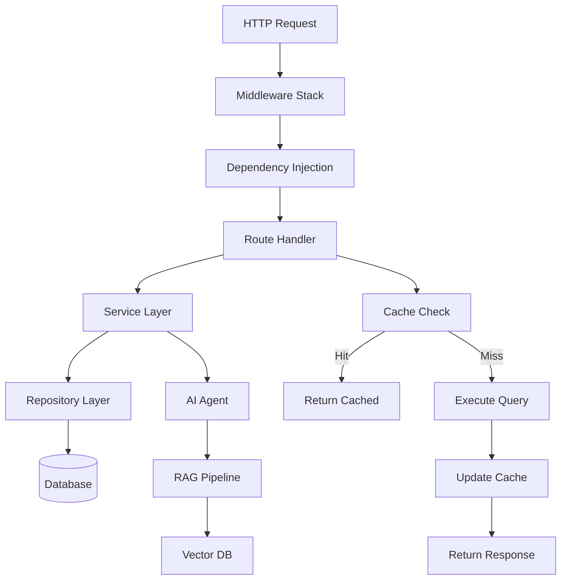

### Dependency Injection

The backend uses FastAPI's built-in dependency injection system:

```python
# Example: Authentication dependency
from fastapi import Depends
from app.core.security.permissions import require_role

@router.get("/admin")
async def admin_endpoint(user: User = Depends(require_role("admin"))):
    return {"message": "Admin access granted"}
```

### Repository Pattern

```
repositories/
├── base.py              # Generic CRUD operations
├── user.py              # User-specific operations
├── document.py          # Document operations
├── workflow.py          # Workflow operations
└── __init__.py
```

### Service Layer

```
services/
├── auth_service.py      # Authentication logic
├── agent_service.py     # AI agent orchestration
├── chat_service.py      # Chat operations
├── workflow_service.py  # Workflow execution
├── memory_service.py    # Conversation memory
└── __init__.py
```

### Database Layer

```python
# Database session management
from app.database.session import AsyncSessionLocal

async def get_db():
    async with AsyncSessionLocal() as session:
        try:
            yield session
        finally:
            await session.close()
```

### Authentication

- **JWT Tokens**: Access and refresh tokens
- **OAuth 2.0**: GitHub, Google, Microsoft integration
- **RBAC**: Role-based access control with permissions

### AI Layer

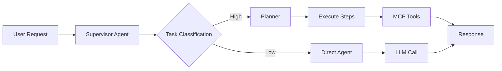

### Memory Layer

- **Redis**: Short-term conversation memory
- **PostgreSQL**: Long-term persistent memory
- **Qdrant**: Semantic memory with embeddings

### Workflow Engine

```python
# Workflow execution example
from app.workflows.executor import WorkflowExecutor

executor = WorkflowExecutor(workflow_id=uuid)
result = await executor.execute(input_data={...})
```

### Logging

Structured JSON logging with request correlation:

```python
import structlog

logger = structlog.get_logger()
logger.info("workflow_started", workflow_id=workflow.id, user_id=user.id)
```

### Exception Handling

```python
from app.core.exceptions.handlers import (
    validation_exception_handler,
    http_exception_handler,
)

app.add_exception_handler(Exception, http_exception_handler)
```

### Configuration

Environment-based configuration with Pydantic Settings:

```python
from app.core.config.settings import get_settings

settings = get_settings()
print(settings.database.database_url)
```

---

## 🌐 Frontend Architecture

### Next.js App Router

```
app/
├── layout.tsx           # Root layout with providers
├── page.tsx             # Home page
├── api/                 # API routes (server-side)
├── (auth)/              # Auth route group
│   ├── login/
│   ├── register/
│   └── forgot-password/
├── dashboard/           # Protected routes
│   ├── chat/
│   ├── documents/
│   ├── agents/
│   └── settings/
└── globals.css          # Global styles
```

### Layouts

| Layout | Purpose |
|--------|---------|
| `layout.tsx` | Root layout with HTML structure, theme provider, query client |
| `dashboard/layout.tsx` | Dashboard layout with sidebar and navbar |
| `(auth)/layout.tsx` | Authentication pages layout |

### Components

```
components/
├── ui/                  # Shadcn/ui primitives
│   ├── button.tsx
│   ├── input.tsx
│   ├── card.tsx
│   └── dialog.tsx
├── layout/              # Layout components
│   ├── navbar.tsx
│   ├── sidebar.tsx
│   └── footer.tsx
├── chat/                # Chat components
│   ├── chat-message.tsx
│   ├── chat-input.tsx
│   └── chat-list.tsx
└── documents/           # Document components
    ├── document-upload.tsx
    ├── document-list.tsx
    └── document-preview.tsx
```

### Feature Modules

| Feature | Components | Hooks | Services |
|---------|------------|-------|----------|
| **Chat** | `ChatInterface`, `MessageList` | `useChat` | `chatService` |
| **Documents** | `DocumentUpload`, `DocumentList` | `useDocuments` | `documentService` |
| **Agents** | `AgentCard`, `AgentConfig` | `useAgents` | `agentService` |
| **Workflows** | `WorkflowBuilder`, `WorkflowRun` | `useWorkflows` | `workflowService` |

### State Management

**Zustand Stores:**

```typescript
// auth-store.ts
import { create } from 'zustand'

interface AuthState {
  user: User | null
  token: string | null
  login: (credentials: Credentials) => Promise<void>
  logout: () => void
}

export const useAuthStore = create<AuthState>()(...)
```

### API Layer

```typescript
// api/client.ts
const apiClient = axios.create({
  baseURL: process.env.NEXT_PUBLIC_API_URL,
  timeout: 10000,
})

apiClient.interceptors.response.use(
  (response) => response.data,
  (error) => Promise.reject(error)
)
```

### Authentication

- **JWT Token Storage**: Secure HTTP-only cookies
- **OAuth Flow**: Redirect-based authentication
- **Protected Routes**: Middleware-based route protection

```typescript
// middleware.ts
export function middleware(request: NextRequest) {
  const token = request.cookies.get('auth_token')
  if (!token && protectedPaths.includes(request.nextPathname)) {
    return NextResponse.redirect(new URL('/login', request.url))
  }
}
```

### Protected Routes

```
middleware.ts             # Global middleware
src/
├── middleware/
│   └── auth-middleware.ts
└── types/
    └── auth.ts          # Auth type definitions
```

### Dark Mode

Next.js `next-themes` for theme management:

```typescript
// theme-provider.tsx
import { ThemeProvider } from 'next-themes'

export function ThemeProviderWrapper({ children }) {
  return (
    <ThemeProvider attribute="class" defaultTheme="system">
      {children}
    </ThemeProvider>
  )
}
```

### Responsive Design

- **Mobile-first**: Tailwind responsive utilities
- **Breakpoints**: `sm`, `md`, `lg`, `xl`, `2xl`
- **Sidebar**: Collapsible on mobile

### Streaming UI

Server-Sent Events for real-time responses:

```typescript
// Chat component with streaming
const eventSource = new EventSource('/api/v1/chat/stream')
eventSource.onmessage = (e) => {
  setMessages(prev => [...prev, e.data])
}
```

---

## 🤖 AI Architecture

### Multi-Agent System

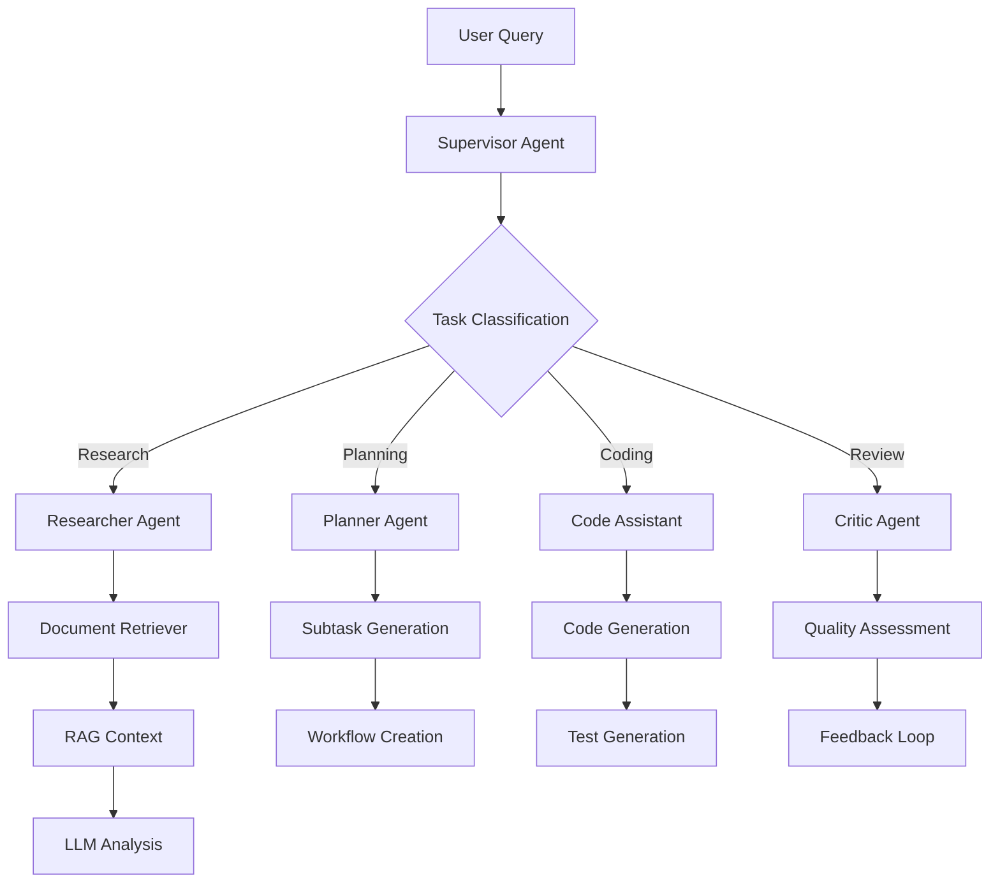

### Agent Types

| Agent | Purpose | Tools |
|-------|---------|-------|
| **Supervisor** | Route and prioritize tasks | LLM, RAG |
| **Planner** | Create execution plans | Workflow Engine |
| **Researcher** | Document analysis | Document Store, Web Search |
| **Analyst** | Data analysis | Pandas, NumPy |
| **Critic** | Review and quality check | RAG, LLM |
| **Code Assistant** | Code generation | File Tools, Terminal |
| **Document QA** | Document questions | Vector DB |

### Communication Between Agents

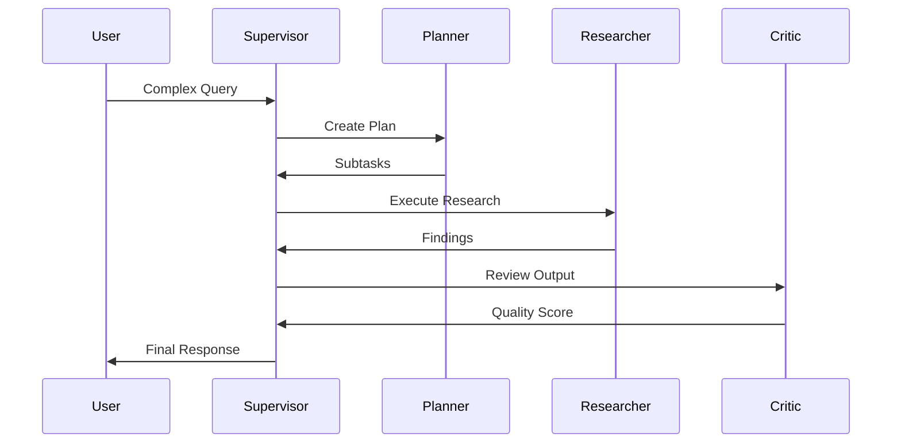

### Orchestration

LangGraph for agent orchestration:

```python
from langgraph.graph import StateGraph

workflow = StateGraph(AgentState)
workflow.add_node("supervisor", supervisor_node)
workflow.add_node("researcher", researcher_node)
workflow.add_node("critic", critic_node)

workflow.add_conditional_edges(
    "supervisor",
    lambda x: x["next_agent"]
)
```

---

## 📚 RAG Pipeline

### Document Upload

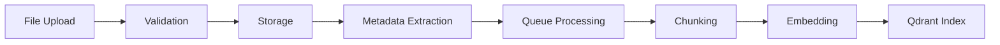

### Chunking Strategy

```python
# Semantic chunking with parent-child relationships
from langchain.text_splitter import RecursiveCharacterTextSplitter

splitter = RecursiveCharacterTextSplitter(
    chunk_size=1000,
    chunk_overlap=200,
    separators=["\n\n", "\n", " ", ""]
)
```

### Embedding Models

| Model | Dimensions | Use Case |
|-------|------------|----------|
| `text-embedding-3-large` | 3072 | High-quality embeddings |
| `text-embedding-3-small` | 1536 | Cost-effective embeddings |
| `BAAI/bge-small-en` | 384 | Local embeddings |

### Vector Database (Qdrant)

```python
from qdrant_client import QdrantClient

client = QdrantClient(url=settings.qdrant.url)
client.recreate_collection(
    collection_name="documents",
    vectors_config=VectorParams(size=1536, distance=Distance.COSINE)
)
```

### Retriever

```python
from langchain_qdrant import QdrantVectorStore

vector_store = QdrantVectorStore(
    client=qdrant_client,
    collection_name="documents",
    embedding=embeddings
)

retriever = vector_store.as_retriever(
    search_type="similarity_score_threshold",
    search_kwargs={"score_threshold": 0.7}
)
```

### Re-ranking

Using cross-encoders for result re-ranking:

```python
from sentence_transformers import CrossEncoder

reranker = CrossEncoder('cross-encoder/ms-marco-MiniLM-L-6-v2')
scores = reranker.predict([(query, doc) for doc in candidates])
```

### Citation System

```python
@dataclass
class Citation:
    document_id: str
    chunk_id: str
    page_number: int
    relevance_score: float
    content_snippet: str
```

### Streaming

Server-Sent Events for real-time streaming:

```python
async def stream_response(query: str):
    async for chunk in llm.stream(prompt):
        yield f"data: {json.dumps({'chunk': chunk})}\n\n"
```

### Knowledge Base

Organized collections of documents:

```python
class KnowledgeBase:
    name: str
    description: str
    embedding_model: str
    documents: List[Document]
    settings: Dict[str, Any]
```

---

## 🔌 MCP Integration

### MCP Client

```python
from mcp import Client

client = Client()
tools = await client.list_tools()

result = await client.call_tool(
    name="file_reader",
    arguments={"path": "/path/to/file"}
)
```

### MCP Server

```python
from mcp import Server, Tool

server = Server("file-tools")

@server.tool()
async def read_file(path: str) -> str:
    with open(path, 'r') as f:
        return f.read()
```

### Registry

Central tool registry:

```json
{
  "servers": [
    {
      "name": "filesystem",
      "type": "python",
      "command": "python -m mcp_filesystem",
      "tools": ["read_file", "write_file", "list_files"]
    }
  ]
}
```

### Tool Discovery

Dynamic tool discovery and loading:

```python
async def discover_tools():
    registry = load_registry()
    for server in registry.servers:
        tools = await client.discover(server)
        tool_map[server.name] = tools
```

### Tool Execution

```python
async def execute_tool(tool_name: str, args: dict):
    client = get_tool_client(tool_name)
    return await client.execute(tool_name, args)
```

### Permissions

Role-based tool access:

```python
PERMISSIONS = {
    "filesystem": ["read_file", "write_file"],
    "web_search": ["search", "fetch_url"],
    "database": ["query", "execute"]
}
```

### Security

- Tool sandboxing
- Permission validation
- Audit logging

---

## 🗄️ Database

### PostgreSQL Schema

```sql
-- Core tables
CREATE TABLE users (
    id UUID PRIMARY KEY,
    email VARCHAR(255) UNIQUE NOT NULL,
    password_hash VARCHAR(255) NOT NULL,
    full_name VARCHAR(255),
    created_at TIMESTAMP WITH TIME ZONE
);

CREATE TABLE documents (
    id UUID PRIMARY KEY,
    user_id UUID REFERENCES users(id),
    name VARCHAR(255),
    status VARCHAR(30),
    created_at TIMESTAMP WITH TIME ZONE
);
```

### Redis Usage

| Purpose | Key Pattern | TTL |
|---------|-------------|-----|
| Sessions | `session:{id}` | 24h |
| Cache | `cache:{key}` | 1h |
| Rate Limits | `rate_limit:{ip}` | 1m |
| Queue | `queue:{name}` | - |

### Qdrant Collections

```python
# Document chunks collection
collection_config = {
    "name": "document_chunks",
    "vectors": {
        "dense": VectorParams(size=1536, distance=Distance.COSINE)
    },
    "optimizers": {"default_segment_size": 100000}
}
```

### MinIO Buckets

| Bucket | Purpose |
|--------|---------|
| `airc-documents` | Uploaded documents |
| `airc-processed` | Processed files |
| `airc-vectors` | Vector data |

### Relationships

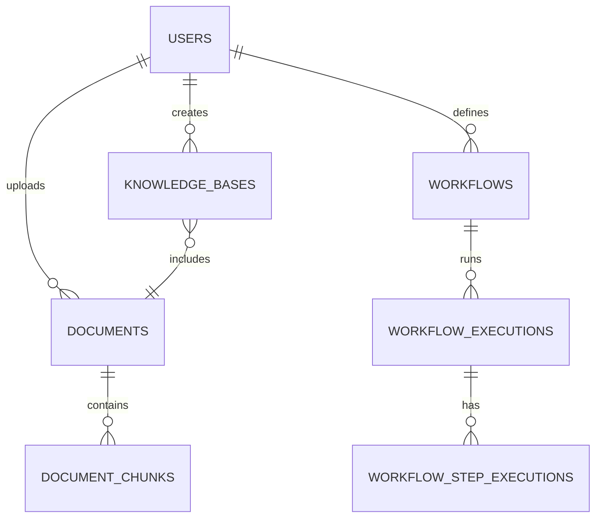

### Migrations

Using Alembic for database migrations:

```bash
# Create migration
alembic revision --autogenerate -m "Add user preferences"

# Apply migrations
alembic upgrade head

# Rollback
alembic downgrade -1
```

---

## ⚙️ Environment Variables

> **The project uses only one root `.env` file** located at `ai-research-copilot/.env`. All configuration for both Backend (FastAPI) and Frontend (Next.js) is loaded from this single file. No additional `.env` files are needed.

Copy the example file and fill in your values:

```bash
cp .env.example .env
```

### Backend Variables

| Variable | Description | Required | Default |
|----------|-------------|----------|---------|
| `APP_ENV` | Application environment | No | `development` |
| `APP_DEBUG` | Debug mode | No | `true` |
| `HOST` | Server host | No | `0.0.0.0` |
| `PORT` | Server port | No | `8000` |
| `WORKERS` | Uvicorn workers | No | `4` |
| `LOG_LEVEL` | Logging level | No | `debug` |
| `CORS_ORIGINS` | Allowed origins | No | `http://localhost:3000` |

### Database Variables

| Variable | Description | Required | Default |
|----------|-------------|----------|---------|
| `POSTGRES_USER` | Database user | No | `airc_user` |
| `POSTGRES_PASSWORD` | Database password | No | `airc_password` |
| `POSTGRES_DB` | Database name | No | `airc_db` |
| `POSTGRES_HOST` | Database host | No | `localhost` |
| `POSTGRES_PORT` | Database port | No | `5432` |

### Cache Variables

| Variable | Description | Required | Default |
|----------|-------------|----------|---------|
| `REDIS_HOST` | Redis host | No | `localhost` |
| `REDIS_PORT` | Redis port | No | `6379` |
| `REDIS_DB` | Redis database | No | `0` |

### Storage Variables

| Variable | Description | Required | Default |
|----------|-------------|----------|---------|
| `MINIO_ENDPOINT` | MinIO endpoint | No | `localhost:9000` |
| `MINIO_ROOT_USER` | MinIO access key | No | `airc_admin` |
| `MINIO_ROOT_PASSWORD` | MinIO secret key | No | `airc_password` |
| `MINIO_BUCKET_NAME` | Default bucket | No | `airc-documents` |
| `MINIO_SECURE` | Use HTTPS | No | `false` |

### Vector Database Variables

| Variable | Description | Required | Default |
|----------|-------------|----------|---------|
| `QDRANT_HOST` | Qdrant host | No | `localhost` |
| `QDRANT_PORT` | Qdrant port | No | `6333` |
| `QDRANT_GRPC_PORT` | Qdrant gRPC port | No | `6334` |

### Authentication Variables

| Variable | Description | Required | Default |
|----------|-------------|----------|---------|
| `JWT_SECRET_KEY` | JWT secret | Yes | - |
| `JWT_ALGORITHM` | JWT algorithm | No | `HS256` |
| `JWT_EXPIRATION_HOURS` | Token expiry | No | `24` |

### LLM Provider Variables

| Variable | Description | Required | Default |
|----------|-------------|----------|---------|
| `OPENAI_API_KEY` | OpenAI API key | No | - |
| `OPENAI_DEFAULT_MODEL` | Default model | No | `gpt-4o` |
| `ANTHROPIC_API_KEY` | Anthropic API key | No | - |
| `GOOGLE_API_KEY` | Google API key | No | - |

### Frontend Variables

> These variables are defined in the root `.env` file and loaded by Next.js via `next.config.mjs`.

| Variable | Description | Required | Default |
|----------|-------------|----------|---------|
| `NEXT_PUBLIC_API_URL` | Backend API URL | Yes | `http://localhost:8000/api/v1` |
| `NEXT_PUBLIC_APP_NAME` | App name | No | `AI Research Copilot` |

---

## 🚀 Installation

### Prerequisites

| Tool | Version | Purpose |
|------|---------|---------|
| **Docker** | 24.x+ | Containerization |
| **Docker Compose** | 2.x+ | Service orchestration |
| **Git** | 2.x+ | Version control |
| **Node.js** | 18.x+ | Frontend build |
| **Python** | 3.13 | Backend runtime |
| **uv** | Latest | Python package manager |

### Quick Start

```bash
# Clone the repository
git clone https://github.com/your-org/ai-research-copilot.git
cd ai-research-copilot

# Copy environment file (single root .env for all services)
cp .env.example .env
# Edit .env with your configuration

# Start all services
docker-compose up -d
```

### Backend Setup

```bash
# Navigate to backend
cd ai-research-copilot/backend

# Create virtual environment
python -m venv venv
source venv/bin/activate  # Linux/Mac
# or
.\venv\Scripts\activate  # Windows

# Install dependencies
uv pip install -e .
uv pip install -e .[dev]

# The root .env file is already loaded automatically from ai-research-copilot/.env

# Run database migrations
uv run alembic upgrade head

# Seed database (optional)
uv run python -m app.scripts.seed_db

# Start development server
uvicorn app.main:app --reload
```

### Frontend Setup

```bash
# Navigate to frontend
cd ai-research-copilot/frontend

# Install dependencies
npm install

# The root .env file is loaded automatically via next.config.mjs
# NEXT_PUBLIC_* variables from ai-research-copilot/.env are available at build time

# Start development server
npm run dev
```

### Manual Setup

#### PostgreSQL

```bash
# Using Docker
docker run -d \
  --name postgres \
  -e POSTGRES_USER=airc_user \
  -e POSTGRES_PASSWORD=airc_password \
  -e POSTGRES_DB=airc_db \
  -p 5432:5432 \
  postgres:17-alpine
```

#### Redis

```bash
# Using Docker
docker run -d \
  --name redis \
  -p 6379:6379 \
  redis:7-alpine
```

#### Qdrant

```bash
# Using Docker
docker run -d \
  --name qdrant \
  -p 6333:6333 \
  -p 6334:6334 \
  qdrant/qdrant:v1.12.0
```

#### MinIO

```bash
# Using Docker
docker run -d \
  --name minio \
  -p 9000:9000 \
  -p 9001:9001 \
  -e MINIO_ROOT_USER=airc_admin \
  -e MINIO_ROOT_PASSWORD=airc_password \
  minio/minio:RELEASE.2024-12-13T01-54-12Z \
  server /data --console-address ":9001"
```

---

## 🐳 Docker Setup

### Docker Compose

The `docker-compose.yml` defines all services:

| Service | Port | Description |
|---------|------|-------------|
| `postgres` | 5432 | PostgreSQL database |
| `redis` | 6379 | Redis cache |
| `qdrant` | 6333, 6334 | Vector database |
| `minio` | 9000, 9001 | Object storage |
| `backend` | 8000 | FastAPI backend |
| `celery-worker` | - | Background tasks |
| `celery-beat` | - | Scheduled tasks |
| `nginx` | 80, 443 | Reverse proxy |
| `prometheus` | 9090 | Metrics |
| `grafana` | 3001 | Dashboards |

### Common Commands

```bash
# Start all services
docker-compose up -d

# Stop all services
docker-compose down

# Rebuild services
docker-compose build --no-cache

# Remove volumes
docker-compose down -v

# View logs
docker-compose logs -f backend

# Enter a container
docker-compose exec backend sh

# Check service status
docker-compose ps
```

### Service Management

```bash
# Restart a specific service
docker-compose restart backend

# Scale workers
docker-compose up -d --scale celery-worker=4

# Check resource usage
docker-compose stats
```

---

## ▶️ Running the Project

### Development Mode

```bash
# Backend with hot reload
uvicorn app.main:app --reload --host 0.0.0.0 --port 8000

# Frontend with fast refresh
npm run dev

# Access at http://localhost:3000
```

### Production Mode

```bash
# Build frontend
npm run build
npm run start

# Run backend with Gunicorn
gunicorn app.main:app -w 4 -b 0.0.0.0:8000

# Or use Docker
docker-compose up -d
```

### Health Checks

```bash
# Backend health
curl http://localhost:8000/health

# Database connection
curl http://localhost:8000/api/v1/health/database

# AI services
curl http://localhost:8000/api/v1/health/ai
```

---

## 📖 API Documentation

### Swagger UI

Access the interactive API documentation at:
```
http://localhost:8000/docs
```

### OpenAPI Schema

Download the OpenAPI schema:
```
http://localhost:8000/openapi.json
```

### Authentication Endpoints

| Method | Endpoint | Description |
|--------|----------|-------------|
| `POST` | `/api/v1/auth/login` | User login |
| `POST` | `/api/v1/auth/logout` | User logout |
| `POST` | `/api/v1/auth/register` | User registration |
| `POST` | `/api/v1/auth/refresh` | Refresh token |

### Chat Endpoints

| Method | Endpoint | Description |
|--------|----------|-------------|
| `POST` | `/api/v1/chat` | Send message |
| `POST` | `/api/v1/chat/stream` | Stream response |
| `GET` | `/api/v1/chat/sessions` | List sessions |

### Document Endpoints

| Method | Endpoint | Description |
|--------|----------|-------------|
| `POST` | `/api/v1/documents/upload` | Upload document |
| `GET` | `/api/v1/documents` | List documents |
| `DELETE` | `/api/v1/documents/{id}` | Delete document |

### Agent Endpoints

| Method | Endpoint | Description |
|--------|----------|-------------|
| `POST` | `/api/v1/agents/run` | Execute agent |
| `GET` | `/api/v1/agents/config` | Get configurations |

### Streaming

Server-Sent Events for real-time updates:

```javascript
const eventSource = new EventSource('/api/v1/chat/stream');
eventSource.onmessage = (event) => {
  console.log('Received:', event.data);
};
```

---

## 🔐 Authentication

### JWT Authentication

```python
from jose import jwt

token = jwt.encode(
    {"sub": user.email, "role": "user"},
    settings.jwt.secret_key,
    algorithm=settings.jwt.algorithm
)
```

### OAuth Integration

```python
# GitHub OAuth flow
@app.get("/auth/github")
async def github_login():
    redirect_uri = url_for("auth_callback")
    return OAuth2AuthorizationRequest(
        authorization_url="https://github.com/login/oauth/authorize",
        redirect_uri=redirect_uri
    )
```

### RBAC Permissions

| Role | Permissions |
|------|---------------|
| `user` | Read, write own data |
| `researcher` | All user + document analysis |
| `admin` | All permissions |
| `system` | System operations |

### Protected Routes

```typescript
// Frontend route protection
import { useAuthStore } from '@/store/auth-store'

const ProtectedRoute = ({ children }) => {
  const { user } = useAuthStore()
  if (!user) return <Navigate to="/login" />
  return children
}
```

---

## 🔄 Development Workflow

### Branch Strategy

```
main                    # Production-ready code
├── develop             # Development branch
├── feature/*           # Feature branches
├── hotfix/*            # Hotfix branches
└── release/*           # Release branches
```

### Commit Convention

```
feat: Add new feature
fix: Fix bug
docs: Update documentation
style: Code formatting
refactor: Code refactoring
test: Add/update tests
chore: Update dependencies
```

### Pull Requests

1. Create PR from feature branch to `develop`
2. Ensure CI passes
3. Request review from team
4. Merge after approval

### Code Reviews

- **Backend**: Use `/code-review` skill
- **Frontend**: Check TypeScript, accessibility
- **AI**: Verify agent logic and safety

### Testing

```bash
# Backend tests
uv run pytest tests/ -v --cov=app

# Frontend tests
npm test

# E2E tests
npm run test:e2e
```

### Linting & Formatting

```bash
# Backend
ruff check .
black .
mypy app/

# Frontend
eslint . --fix
prettier --write .
```

---

## 🧪 Testing

### Backend Tests

```bash
# Run all tests
uv run pytest tests/ -v

# Run with coverage
uv run pytest tests/ --cov=app --cov-report=html

# Run specific test
uv run pytest tests/unit/test_auth.py -v
```

### Frontend Tests

```bash
# Component tests
npm test -- --run

# E2E tests
npm run test:e2e
```

### Integration Tests

```python
@pytest.mark.integration
async def test_rag_pipeline():
    # Test full RAG flow
    pass
```

### Coverage

Target: **80%+ coverage**

```bash
# Generate coverage report
uv run pytest --cov=app --cov-report=term-missing
```

---

## 🚀 Deployment

### Development

```bash
docker-compose up -d
```

### Staging

```bash
# Deploy to staging
vercel --prod --token=$VERCEL_TOKEN
```

### Production

```bash
# Production Docker
docker-compose -f docker-compose.prod.yml up -d

# Kubernetes
kubectl apply -f k8s/
```

### Nginx Configuration

```nginx
upstream backend {
    server backend:8000;
}

upstream frontend {
    server frontend:3000;
}

server {
    listen 80;
    
    location /api/ {
        proxy_pass http://backend;
    }
    
    location / {
        proxy_pass http://frontend;
    }
}
```

### GitHub Actions

```yaml
name: CI/CD
on: [push, pull_request]

jobs:
  test:
    runs-on: ubuntu-latest
    steps:
      - uses: actions/checkout@v4
      - uses: actions/setup-python@v5
      - run: pip install -e .[dev]
      - run: pytest tests/
      
  deploy:
    runs-on: ubuntu-latest
    needs: test
    steps:
      - uses: actions/checkout@v4
      - run: docker-compose -f docker-compose.prod.yml up -d
```

---

## 📊 Monitoring

### Prometheus Metrics

```python
from prometheus_client import Counter, Histogram

REQUEST_COUNT = Counter('requests_total', 'Total requests')
REQUEST_DURATION = Histogram('request_duration_seconds', 'Request duration')
```

### Grafana Dashboards

| Dashboard | Metrics |
|-----------|---------|
| **API** | Request rate, latency, errors |
| **Database** | Connections, query time |
| **AI Services** | Token usage, latency |
| **Infrastructure** | CPU, memory, disk |

### Logging

```python
import structlog

logger = structlog.get_logger()
logger.info("user_login", user_id=user.id, ip=request.ip)
```

### Tracing

OpenTelemetry integration:

```python
from opentelemetry import trace

tracer = trace.get_tracer(__name__)
with tracer.start_as_current_span("rag_pipeline"):
    # RAG operations
    pass
```

### Health Checks

```python
@app.get("/health")
async def health_check():
    return {
        "status": "healthy",
        "database": await check_db(),
        "redis": await check_redis(),
        "qdrant": await check_qdrant()
    }
```

---

## 🚨 Troubleshooting

### Common Issues

| Issue | Solution |
|-------|----------|
| **Database connection failed** | Check `POSTGRES_*` env vars |
| **Redis connection refused** | Ensure Redis container is running |
| **Qdrant not found** | Verify `QDRANT_HOST` and port |
| **MinIO bucket not found** | Create bucket in MinIO console |

### Database Errors

```bash
# Check PostgreSQL logs
docker-compose logs postgres

# Reset database
docker-compose down -v
docker-compose up -d postgres
```

### Docker Errors

```bash
# Clean up Docker
docker system prune -a

# Rebuild without cache
docker-compose build --no-cache

# Check disk space
docker system df
```

### Redis Errors

```bash
# Connect to Redis CLI
docker-compose exec redis redis-cli

# Check memory usage
INFO memory
```

### Migration Errors

```bash
# Show migration history
uv run alembic history

# Create new migration
uv run alembic revision --autogenerate -m "description"

# Fix migration
uv run alembic upgrade +1
```

### Next.js Errors

```bash
# Clear Next.js cache
rm -rf .next

# Reinstall dependencies
rm -rf node_modules
npm install

# Check TypeScript errors
npm run typecheck
```

### FastAPI Errors

```bash
# Check logs
docker-compose logs backend

# Validate models
curl -X POST http://localhost:8000/api/v1/documents/validate

# Check OpenAPI schema
curl http://localhost:8000/openapi.json | jq
```

---

## 👨‍💻 Developer Guide

### How to Add a New API

```python
# 1. Create schema in app/schemas/
# 2. Create repository in app/repositories/
# 3. Create service in app/services/
# 4. Add router in app/routes/

# Example: app/routes/example.py
from fastapi import APIRouter, Depends

router = APIRouter()

@router.get("/example")
async def get_example():
    return {"message": "Hello"}
```

### How to Add a New Agent

```python
# 1. Create agent in app/agents/
# 2. Register in agent_service.py
# 3. Add to supervisor routing

from app.agents.base import BaseAgent

class NewAgent(BaseAgent):
    name = "new_agent"
    description = "Handles specific tasks"
    
    async def execute(self, state: AgentState) -> AgentState:
        # Agent logic here
        return state
```

### How to Add a New MCP Tool

```python
# 1. Create tool in app/mcp/tools/
# 2. Register in MCP server
# 3. Add to client configuration

from mcp import Tool

tool = Tool(
    name="custom_tool",
    description="Custom tool description",
    input_schema={...}
)
```

### How to Add a New Workflow

```python
# 1. Define in app/workflows/definitions.py
# 2. Add execution logic
# 3. Register in workflow_service

WORKFLOW_DEFINITIONS = {
    "research": {
        "nodes": [...],
        "edges": [...]
    }
}
```

### How to Add a New Page (Frontend)

```tsx
// 1. Create page in app/new-page/page.tsx
// 2. Add layout if needed
// 3. Create components
// 4. Add to navigation
```

### How to Add a New Component

```tsx
// components/ui/new-component.tsx
import { forwardRef } from 'react'

export const NewComponent = forwardRef<HTMLDivElement, divProps>(
  ({ className }, ref) => (
    <div ref={ref} className={cn(componentStyles(), className)}>
      {/* Component content */}
    </div>
  )
)
```

### How to Add a New Database Model

```python
# 1. Create model in app/models/
# 2. Create schema in app/schemas/
# 3. Create repository in app/repositories/
# 4. Create Alembic migration
# 5. Update CRUD operations
```

---

## 🤝 Contributing

### Code Style

- **Python**: Black, Ruff, Mypy
- **TypeScript**: Prettier, ESLint
- **CSS**: Tailwind utilities

### Naming Convention

| Type | Convention |
|------|------------|
| Functions | `snake_case` |
| Classes | `PascalCase` |
| Constants | `UPPER_CASE` |
| Files | `kebab-case` |
| Components | `PascalCase.tsx` |

### Architecture Rules

1. **Separation of Concerns**: Each layer has distinct responsibilities
2. **Dependency Inversion**: Depend on abstractions, not implementations
3. **Single Responsibility**: One class, one reason to change
4. **Open/Closed**: Open for extension, closed for modification

### Best Practices

- Write tests for new features
- Document code with docstrings
- Use type hints everywhere
- Follow existing patterns
- Keep commits focused

---

## 📄 License

This project is licensed under the MIT License - see the [LICENSE](LICENSE) file for details.

---

## 💬 Support

- **Issues**: [GitHub Issues](https://github.com/your-org/ai-research-copilot/issues)
- **Discussions**: [GitHub Discussions](https://github.com/your-org/ai-research-copilot/discussions)
- **Email**: team@airesearchcopilot.com

---

## 🙏 Acknowledgments

- [FastAPI](https://fastapi.tiangolo.com/)
- [Next.js](https://nextjs.org/)
- [LangChain](https://www.langchain.com/)
- [Qdrant](https://qdrant.tech/)
- [Radix UI](https://www.radix-ui.com/)
- [Tailwind CSS](https://tailwindcss.com/)

---

**Build by:** Abhishek Bisht

**Note**: This documentation was generated based on the project architecture. Some assumptions may have been made where information was not available in the repository. Please contribute to improve this documentation.
